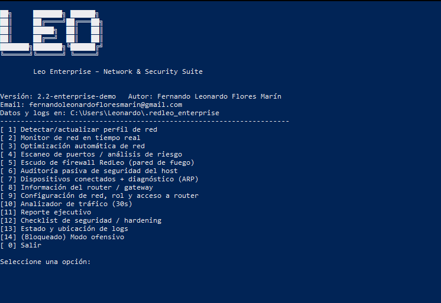

# RedLeo Enterprise – Network & Security Suite


**Autor:** Fernando Leonardo Flores Marín  
**Email:** fernandoleonardofloresmarin@gmail.com  

RedLeo Enterprise es una herramienta de **monitoreo, análisis y defensa de redes e infraestructura**, diseñada para entornos de:

- Equipos personales
- Redes corporativas pequeñas y medianas
- Infraestructuras de telecomunicaciones
- Servidores y entornos TI

La suite está orientada a **ciberseguridad defensiva**, observabilidad y apoyo a la toma de decisiones técnicas.

---

## 🎯 Funcionalidades principales

- Detección y perfilado de la red local.
- Medición de latencia, estabilidad y pérdida de paquetes.
- Auditoría pasiva de puertos y servicios expuestos.
- Recomendaciones de endurecimiento (hardening) y firewall.
- Información del router/gateway (IP, posible hostname, respuesta).
- Listado de dispositivos conectados en la red local.
- Modo orientado a distintos roles (personal, PyME, entorno enterprise).
- Generación de **reporte ejecutivo**, con opción de exportar a PDF.

---

## 🧰 Tecnologías utilizadas

- Python 3
- `psutil`
- `ping3`
- `tabulate`
- `reportlab` (opcional, para exportar a PDF)

Instalación de dependencias:

```bash
pip install psutil ping3 tabulate reportlab
